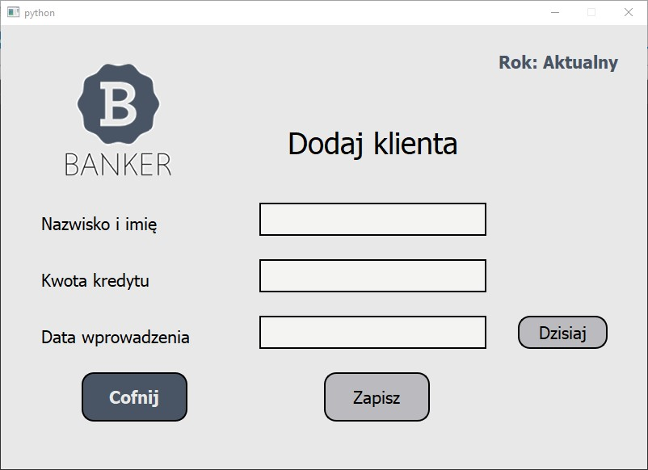
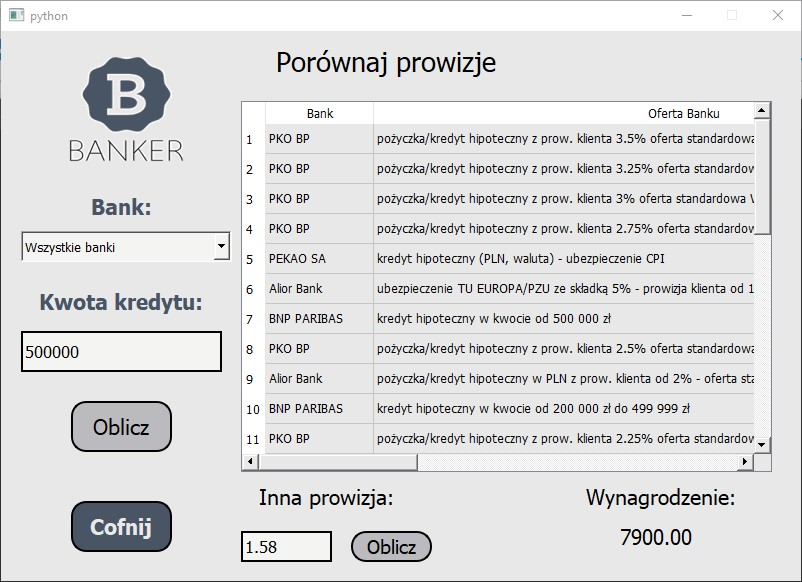

# Banker

This is a desktop application directed at credit advisors (both companies and private advisors). Credit advisors usually work with different banks using different systems. Each bank has their own system where all the data are collected. Unfortunately it is not the best solution for the credit advisors who always have to search for information in different systems. This app is designed to be a database of information collected from those different systems into one.

# How does it work?

This system is pretty easy to use. After logging in we will see a simple menu - where we can choose different options. I will describe below how looks the whole process of accepting a new client until creating the invoice at the end. 

First of all we need to choose "Dodaj klienta" (Add a new client) from the main menu. There we have to enter simple information - First and Last name, value of the future credit and the date. After submitting the new client - we may find them in "Klienci" -> "Rozpoczęci klienci" (clients -> initialized clients). At this point we may delete them from the database, finalize them (it means that the credit has been accepted by the bank) or calculate commissions in all the banks which we work with. Let's assume that we are already at the end of the whole credit process with the Bank and our case has been accepted in the chosen Bank. In the "Rozpoczęci klienci" window we will have to choose the person in the drop box above the "sfinalizuj" button. We will have to give the date of acceptance by the bank and it will take us to another window. This person data will be filled out automatically - we only have to choose the bank and the offer which has been accepted by the bank (if we worked with a bank that is not in our database - we may enter the new bank's data here manually). After submitting this process - our client will be saved in the month when they ended the process. It will automatically take us to this month window. Being in a certain month window we have a possibility to add chosen clients to the new invoice. We just have to tick the check box next to their names and click "Zapisz do faktury" (Save to the invoice). The invoices we can find in the main menu. After entering the invoices window - I'd recommend to fill out the invoice personal data ("Dane do faktury") first (Our address, bank's address, tax and some other options). In the invoices window, after saving the personal data, we just need to create the invoice "Utwórz fakturę". All the persons who were in the invoices table will be included in the invoice. You will be asked to give the invoice name and that's it. You can open your invoice in the program and print it or send it by email. That's the end of this process.

There are some other different options but the one described above is the most common path.

# Libraries/modules

- PyQt5 - all the functionalities regarding the app - connecting buttons, creating the layout etc.
- mysql - connecting with the mysql database
- hashlib - for encrypting sensitive data
- six - for working with certain regular data
- datetime - used for getting the dates
- Fernet - for encrypting local data

# Additional information

This app is fully functional. You can download this repository and run the Kalkulator_Bankowy.py file. There might be a possibility that you could have some missing modules. After downloading the missing parts you should be able to run the app. I disabled the database and erased some encrypting code due to safety. It should not affect the app itself because you should never encounter the login window. The database within the app is stored locally so you shouldn't have any problems with it. All the data in the database directories are encrypted but since there will be no login into the app - your data on your local device will not be entirely safe. If you don't want to run it on your own device - you can have a little insight of the app with the images below (or in the Screenshots directory).

# Screenshots
- Adding a client:

- Menu with archived year loaded:

- Database of all months:

- Client finalization:

- Commissions:

- Comparing commissions:

- Creating account:

- Creating a new invoice:

- Database menu:

- Encrypted data in different files:

- Initiated clients:

- Invoices menu:

- Login:

- Main menu:

